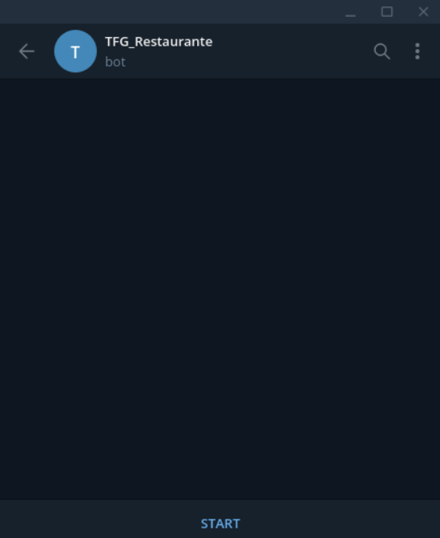
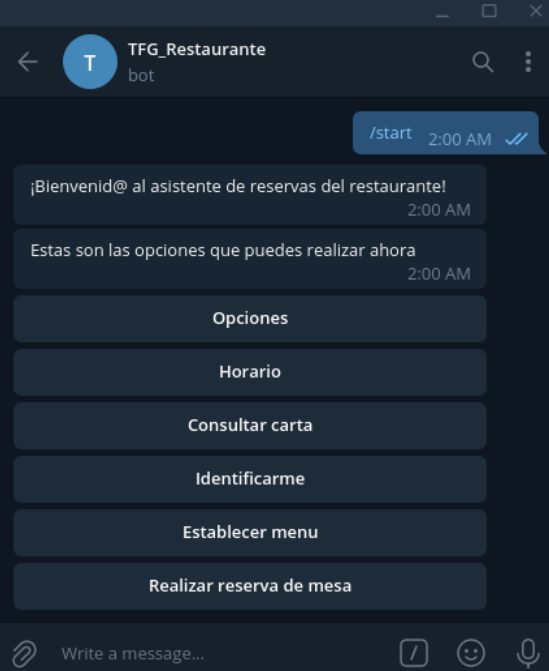
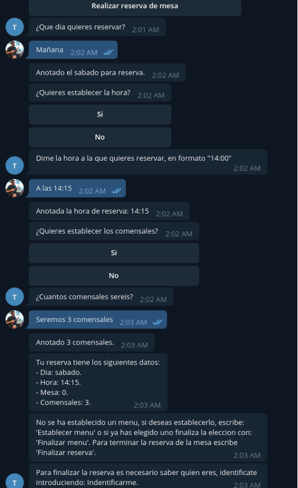

### Talk to the bot

Once you have the bot deployed locally, you can chat with it in two
different ways.

The first is through natural language, you can do this if you run the server
using the "rasa shell" command.

The second case is through curl requests in JSON format to the server, this
method should be used if the server has been deployed using Docker

```
curl -XPOST http://RASA_SERVER_IP:5005/webhooks/rest/webhook -H
"Content-type: application/json" -d '{"sender": "test", "message": "Hello"}'
```

If you are using the load balancer provided in the repository, requests are
can be done via http or https without specifying port 5005:

```
- curl -XPOST http://LOAD_BALANCER_IP/webhooks/rest/webhook -H
"Content-type: application/json" -d '{"sender": "test", "message": "Hello"}'
```

```
- curl -XPOST https://LOAD_BALANCER_IP/webhooks/rest/webhook -H
"Content-type: application/json" -d '{"sender": "test", "message": "Hello"}'
```

### Telegram

Access Telegram and search: `TFG_Restaurante`, when you open the conversation you will see an empty chat:



Once the bot is started by pressing `START`, it will present itself and show you a list of
button options:



You can interact with the bot either through text messages or using the
buttons displayed when entering `Options`, an example of a conversation would be the
Next:

